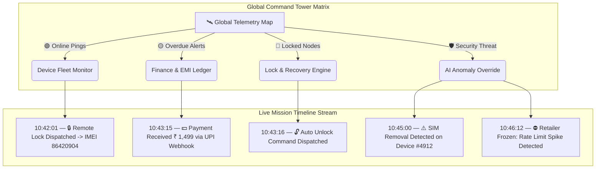

# 🛰️ SuperAdmin Master Plan — NASA Mission Control & Global Command Tower Architecture

> **Artifact Location:** `<Artifact Directory>/superadmin_nasa_mission_control_master_plan.md`  
> **Project Scope:** `UniGuard Pro` — `uniai-superadmin-android` & Master Control Tower  
> **Design Philosophy:** Fusion of **Tesla Fleet Dashboard + Microsoft Intune + Android Enterprise Console + CrowdStrike + NASA Mission Control**  
> **Canonical Hierarchy:** `SuperAdmin (Global Sovereign) ➔ Distributor (Territory Master) ➔ Retailer (POS Merchant) ➔ Customer (Financed End-User) ➔ Device (Enrolled Hardware Node)`

---

## 💡 Executive Summary & Critique of Generic SaaS Mockups

### ❌ The Flaws of Generic SaaS Mockups (Why "Companies" & Basic Dashboards Fail)
In generic SaaS templates, "Companies" or generic multi-tenant blocks are placed at the top level. For **UniGuard Pro**, this is an architectural mismatch:
1. **Flawed Hierarchy:** UniGuard is an **EMM / Device Protection & EMI Recovery Platform**. The sovereign operational chain is strictly:
   $$\text{SuperAdmin} \longrightarrow \text{Distributor} \longrightarrow \text{Retailer} \longrightarrow \text{Customer} \longrightarrow \text{Device (Knox / DPC Node)}$$
   An artificial "Companies" KPI dilutes focus away from **Live Device Telemetry** and **Risk Monitoring**.
2. **Dashboard vs. Command Tower:** A standard dashboard merely displays past reports. A **Global Command Tower** acts as a real-time defense & control matrix where SuperAdmins can monitor live heartbeats, detect security breaches (Root/FRP/ADB/SIM Swap), and broadcast instant remote lock/wipe/update commands across millions of hardware nodes.

---

## 🏛️ Master Architectural Breakdown — Every Option & Feature Explained

### 1. 🛡️ Left Navigation Dock (Sovereign Modules)

| Module | Core Purpose & Problem Solved | Key Controls & Actions |
|---|---|---|
| 🏠 **Control Tower (Home)** | Live 360° platform health & real-time telemetry stream | Active fleet counter, 72h offline timers, live threat scores, server health. |
| 🏢 **Distributor Network** | Territory master management & credit governance | Create distributors, assign credit lines, set territory boundaries, KYC, commission tiers, instant suspension kill-switch. |
| 🏪 **Retailer Network** | Store POS merchant oversight & license distribution | Monitor store sales, active finance volume, overdue accounts, scan velocity, suspicious activation spikes, 1-tap store freeze. |
| 👤 **Customer Registry** | Universal end-user dossier & credit risk tracking | Search by Aadhaar / Mobile / EMI ID / IMEI; view risk score, payment history, device lock state, timeline events. |
| 📱 **Device Fleet (Heart of UniGuard)** | Real-time hardware node monitoring | Track Online / Offline (>24h) / Locked / Hard-Locked / Tampered / Rooted / FRP Attempt states; live battery & SIM status. |
| 🔑 **Kits & License Kernel** | Batch key forge & HMAC signature minting | Mint FIPS 140-3 HMAC-SHA256 license batches (1k, 10k, 50k, 100k), allocate to distributors, track expiry & usage. |
| 💵 **Finance & Revenue Intel** | Platform-wide financial ledger & EMI tracking | Distributor outstanding, retailer credit lines, daily collections, overdue risk exposure, auto-debit webhook status. |
| 🔒 **Lock & Recovery Engine** | Remote hardware control & field asset protection | Trigger Remote Lock, Soft Lock, Hard Lock, Emergency Lock, Recovery Mode, Police Mode, Local QR Override. |
| 📋 **Policies & Templates** | Hardware restriction & DPC profile forge | Configure Knox policies, FRP bypass keys, kiosk wallpapers, USB/ADB disable rules, 72h offline lock timers. |
| ⚡ **Command Center (NASA Mission Control)** | Mass broadcast & instant payload dispatch | Broadcast Remote Lock, Broadcast Unlock, Mass Wallpaper Push, Push APK Updates, Force Sync across thousands of devices. |
| 📊 **Reports & BI Analytics** | Deep business intelligence & predictive risk models | Collection analytics, distributor performance rankings, recovery success rates, hardware failure trends. |
| 🛡️ **Immutable Audit Vault** | Forensics-grade tamper-proof audit logging | Cryptographically signed logs of WHO locked/unlocked WHAT device, WHEN, from WHICH IP/GPS location, with full payload context. |
| ⚙️ **System Infrastructure Settings** | Platform configuration & gateway integrations | Firebase Cloud Messaging keys, R2DBC database pools, Redis cache, SMS/WhatsApp gateways, Knox API credentials. |

---

### 2. 🔝 Top Bar & Sovereign Controls

- 🔍 **Universal Search Matrix (`⌘K`):** Instantly query across **IMEI, Serial Number, Customer Mobile, Aadhaar, Retailer Name, Distributor Code, License Key, or Command ID**.
- 🔔 **High-Priority Telemetry Alerts:** Live notification stream categorized by severity (🔴 Critical Security Breach, 🟡 Payment Overdue >7 Days, 🔵 Knox Token Expiry, 🟢 System Auto-Recovery).
- ⚡ **1-Tap Fast Pass Auth:** Instant biometric & hardware TOTP 2FA bypass for authorized SuperAdmin testing.
- 🌓 **Obsidian Dark / Porcelain Light Theme:** Dynamic theme engine engineered for low-eyestrain mission control environments.

---

### 3. 📊 High-Impact KPI Telemetry Cards

Instead of generic SaaS counters, the UniGuard Command Tower features **8 Real-Time Operational Telemetry Metrics**:

1. 🌐 **Total Enrolled Fleet Nodes:** All active hardware devices under UniGuard protection.
2. 🟢 **Live Online Nodes (Heartbeat):** Devices sending active ping telemetry within last 5 minutes.
3. ⚠️ **Offline Risk Nodes (>24 Hours):** Devices missing heartbeats, initiating cumulative 72h offline lock countdowns.
4. 🔴 **Active Locked Devices:** Devices currently locked due to EMI default or SuperAdmin freeze.
5. 🛡️ **Tampered & Threat Flagged Nodes:** Devices detecting Root, ADB debugging, FRP bypass attempts, or SIM removal.
6. 💵 **Overdue EMI Risk Exposure (₹):** Total outstanding value across all active overdue accounts.
7. ⚡ **Commands Executed Today:** Total remote payloads (Lock, Unlock, Policy, Wallpaper) dispatched in last 24h.
8. 🏢 **Active Distributor Credit Lines:** Total active credit deployed across master distribution networks.

---

### 4. 🌍 Global Command Tower Map & Real-Time Mission Timeline

---

## 🎨 UI Redesign Plan (`uniai-superadmin-android`)

We will enhance the Jetpack Compose screens in `uniai-superadmin-android` to reflect this **Tesla Fleet + NASA Mission Control** vision:

1. **`SuperAdminDashboardScreen.kt`**: Replace static charts with **Live Command Tower Grid**, **Interactive Fleet Map Placeholder**, **Real-Time Telemetry Ticker**, and **8 High-Impact Telemetry KPI Cards**.
2. **`LicenseMintingKernelScreen.kt`**: Polish HMAC-SHA256 key forge, batch preset selectors, distributor credit line assignments, and batch history streams.
3. **`AiFraudOverrideScreen.kt`**: Upgrade threat score hero card, live security threat stream (FRP, Root, SIM Swap), and 1-tap emergency kill-switches (`[⛔ SUSPEND RETAILER]`, `[🔒 HARD LOCK]`).
4. **`SuperAdminAuthGatewayScreen.kt`**: Retain 1-tap `[⚡ FAST PASS]` entry button alongside 6-digit TOTP keypad and YubiKey 5C NFC status badge.

---

## 🧪 Verification & Deployment Strategy

1. **Code Modification Scoping:** Apply updates to Jetpack Compose screens in `uniai-superadmin-android`.
2. **Compilation:** Verify clean build with `./gradlew assembleDebug` (0 warnings, 0 errors).
3. **Hardware Installation:** Deploy via `adb install --user 0 -r -g` to physical Realme phone `RMX3998`.
4. **Screenshot Capture & Walkthrough Update:** Capture live screenshots of the updated Command Tower screens and embed into `walkthrough.md`.
5. **Plan & Log Sync:** Update `dev_logs.txt` and commit/push changes to GitHub `main` branch.

---

*Plan Location:* `<Artifact Directory>/superadmin_nasa_mission_control_master_plan.md`  
*Signed by: Shoeb Ahmad*
